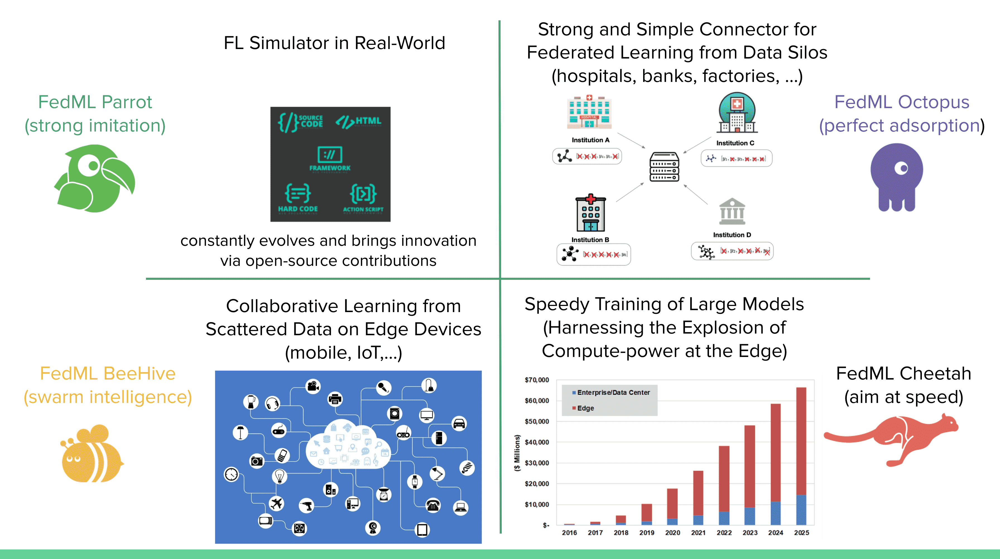

# Welcome to FedML

Thank you for visiting our site. This documentation provides you with everything you need to know about using the FedML platform.

## Why FedML?

FedML, Inc. (https://fedml.ai) enables people and/or organizations to have AI capability from data anywhere at any scale. FedML stands for **“Fundamental Ecosystem Development/Design for Machine Learning”** in a broad scope, and “Federated Machine Learning” in a specific scope. At its current stage, FedML is developing and maintaining a machine learning platform that enables **zero-code, lightweight, cross-platform, and provably secure federated learning and analytics**. It enables machine learning from decentralized data at various **users/silos/edge** nodes without requiring data centralization to the cloud, thus providing maximum privacy and efficiency. It consists of a lightweight and cross-platform Edge AI SDK that is deployable over edge GPUs, smartphones, and IoT devices. Furthermore, it also provides a user-friendly MLOps platform to simplify decentralized machine learning and real-world deployment. FedML supports vertical solutions across a broad range of industries (healthcare, finance, insurance, smart cities, IoT, etc.) and applications (computer vision, natural language processing, data mining, and time-series forecasting). Its core technology is backed by over 3 years of cutting-edge research by its co-founders.

## Outline

This documentation is organized in the following sections:

- **Overview**
   - [Getting Started](docs/en/starter/getting_started.md)
   - [Installation](docs/en/starter/installation.md)
   - [Mission](docs/en/starter/mission.md)
   - [Overview](docs/en/starter/overview.md)
   - [Ecosystem](docs/en/starter/ecosystem.md)
   - [Oss Code Architecture](docs/en/starter/oss_code_architecture.md)
   - [Mlops Video](docs/en/starter/mlops_video.md)
   - [FAQ](docs/en/starter/faq.md)
- **FedML MLOps** - Landing FedML into Reality
   - [Mlops Video](docs/en/starter/mlops_video.md)
   - [User Guide](docs/en/mlops/user_guide.md)
   - [Examples](docs/en/mlops/examples.md)
   - [FAQ](docs/en/mlops/faq.md)
   - [API](docs/en/mlops/api.md)
- **FedML Parrot** - Simulating the Real World
   - [User Guide](docs/en/simulation/user_guide.md)
   - [Examples](docs/en/simulation/examples.md)
   - [FAQ](docs/en/simulation/faq.md)
   - [API](docs/en/simulation/api.md)
- **FedML Octopus**  - Simple Connector for Data Silos
   - [User Guide](docs/en/cross-silo/user_guide.md)
   - [Examples](docs/en/cross-silo/examples.md)
   - [FAQ](docs/en/cross-silo/faq.md)
   - [API](docs/en/cross-silo/api.md)
- **FedML BeeHive** - Collaborative Learning on Smartphones/IoTs
   - [User Guide](docs/en/cross-device/user_guide.md)
   - [Examples](docs/en/cross-device/examples.md)
   - [FAQ](docs/en/cross-device/faq.md)
   - [API](docs/en/cross-device/api.md)
- **FedML Cheetah** - Speedy Training of Large Models
   - [User Guide](docs/en/distributed/user_guide.md)
- **FedML Benchmarks** Benchmarks for FedNLP, FedCV, FedGraphNN and FedIoT
   - [Benchmark FedGrapHNN](docs/en/benchmark/fedgraphnn.md)
- **Resources** 
   - [Papers](docs/en/resources/papers.md)
   - [Video](docs/en/resources/video.md)
   - [Community](docs/en/resources/community.md)

- - -

## Careers
FedML is hiring researchers, engineers, product managers, and related interns.
If you are interested, Please apply at [https://fedml.ai/careers](https://fedml.ai/careers)
